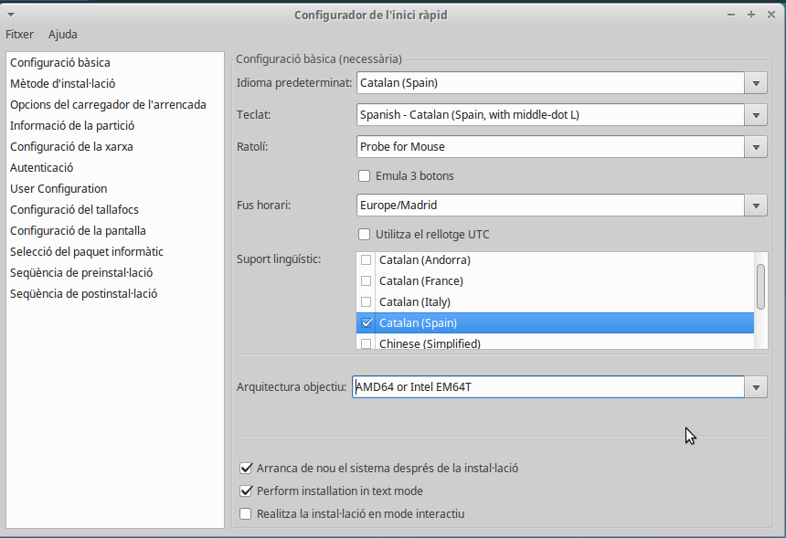
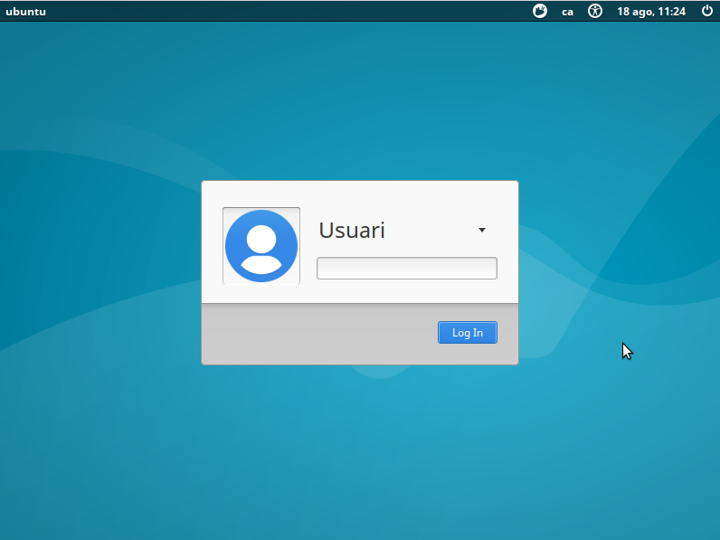

Crear un CD autoinstal·lable
================================

Opcio 1 : Kickstart
--------------------------
Fer servir kickstart (de Red Hat) sembla que és la forma més senzilla de fer-ho. De totes formes no té totes les opcions que té el Debian Installer de Ubuntu i per tant s'ha de recórrer a respondre algunes de les preguntes amb un fitxer *preseed*

L'avantatge d'aquest sistema és que podem respondre les preguntes habituals amb un entorn gràfic i després només hem afegir respostes especialitzades d'Ubuntu a partir d'un fitxer *pressed*

### Procediment per crear el CD

#### 1. Posar els fitxers en un directori temporal

Es parteix d'un CD amb Ubuntu Server (sembla que els LiveCD tenen problemes) i es munta

    # mkdir -p /mnt/iso
    #  mount -o loop ubuntu.iso /mnt/iso

Ara es copien els arxius que fan falta en una carpeta temporal:

    # mkdir -p /opt/ubuntuiso 
    # cp -rt /mnt/iso /opt/ubuntuiso

#### 2. Generar les respostes

Es genera el fitxer de respostes Kickstart a partir del programa system-config-kickstart que està en la distribució d'Ubuntu: 

    # apt-get install system-config-kickstart
    # system-config-kickstart

Proporcionarà un entorn gràfic per preparar les respostes. Algunes de les respostes es poden ignorar perquè no estan activades en Ubuntu (configurar entorn gràfic, autenticació LDAP, etc.. ) i d'altres no donen tantes possibilitats (particionat de disc, ...)

I es graven les respostes en un fitxer. Per exemple *ks.cfg*

El que he fet jo té aquesta forma: 

    #Generated by Kickstart Configurator
    #platform=AMD64 or Intel EM64T

    #System language
    lang ca_ES.UTF-8

    #Language modules to install
    langsupport ca_ES.UTF-8

    #System keyboard
    keyboard es_cat

    #System mouse
    mouse

    #System timezone
    timezone Europe/Madrid

    #Root password
    rootpw --disabled

    #Initial user
    user usuari --fullname "Usuari" --iscrypted --password $1$q1377fKR$sgQw7R1KzxC6drQurGVhm1

    #Reboot after installation
    reboot

    #Use text mode install
    text
    
    #Install OS instead of upgrade
    install

    #Use CDROM installation media
    cdrom

    #System bootloader configuration
    bootloader --location=mbr 

    #Clear the Master Boot Record
    zerombr yes

    #Partition clearing information
    clearpart --all --initlabel 

    #System authorization infomation
    auth  --useshadow  --enablemd5 

    #Firewall configuration
    firewall --disabled 

    #Do not configure the X Window System
    skipx

Al final s'hi poden afegir paquets 'extres' a instal·lar durant la instal·lació: 

    # Paquets a instal·lar
    %packages
    @ xubuntu-desktop
    openssh-server
    screen

L'instal·lador d'Ubuntu fa unes quantes preguntes més que no es poden respondre amb Kickstart. Per fer-ho es genera un arxiu *pressed*, en aquest exemple **ks.preseed** (algunes respostes pot ser que no calguin perquè he estat fent proves...)

    d-i preseed/early_command string umount /media
    d-i partman/unmount_active boolean true
    d-i partman/confirm_write_new_label boolean true
    d-i partman/choose_partition \
    select Finish partitioning and write changes to disk
    d-i partman/confirm boolean true

    d-i pkgsel/include string xubuntu-desktop

També es poden afegir les respostes al fitxer Kickstart començant-les amb pressed (però no sempre m'han funcionat) 

    preseed partman-lvm/confirm_nooverwrite boolean true
    preseed partman-lvm/device_remove_lvm boolean true
    preseed partman/confirm_write_new_label boolean true
    preseed partman/confirm boolean true
    preseed partman/confirm_nooverwrite boolean true

Aquests arxius s'han de copiar a l'arrel del CD: 

    # cp ks.cfg /opt/ubuntuiso
    # cp ks.preseed /opt/ubuntuiso

#### 3. Modificar la configuració

Per evitar que s'aturi esperant que triem l'idioma d'instal·lació es pot modificar el valor de *timeout* al fitxer isolinux/isolinux.cfg (10 és un segon): 

    # cat /opt/ubuntuiso/isolinux/isolinux.cfg
    path 
    include menu.cfg
    default vesamenu.c32
    prompt 0
    timeout 10
    ui gfxboot bootlogo

I per acabar la configuració s'ha de modificar la opció del menú d'arrancada, isolinux/txt.cfg, perquè agafi els fitxers KickStart (modificant la opció append): 

    label install
    menu label ^Install Ubuntu Server
    kernel /install/vmlinuz
    append file=/cdrom/preseed/ubuntu-server.seed initrd=/install/initrd.gz ks=cdrom:/ks.cfg preseed/file=/cdrom/ks.preseed --

Com que el fitxer està dins del CD hi he posat **ks=cdrom:/ks.cfg**. El fitxer no cal que sigui dins del CD ja que es pot proporcionar amb qualsevol dels mètodes habituals http, ftp, o nfs

#### 4. Generar la ISO 
Només queda generar la ISO: 

    # mkisofs -D -r -V "ATTENDLESS_UBUNTU" -cache-inodes -J -l -b isolinux/isolinux.bin -c isolinux/boot.cat -no-emul-boot -boot-load-size 4 -boot-info-table -o /opt/autoinstall.iso /opt/ubuntuiso

####  Provar
Es posa el CD en una màquina i es veurà el procés d'instal·lació i sense cap pregunta al cap d'una estona tindrem el sistema instal·lat amb l'usuari que volem, el servidor SSH, etc...: 

Un problema que he trobat a aquest sistema és que al no estar basat en el CD de Xubuntu s'ha de descarregar els paquets manualment i per tant la instal·lació tarda més temps...

Opció 2 : Fer servir un fitxer 'preseed'
------------------
L'instal·lador de Debian es pot personalitzar simplement creant un fitxer *preseed* amb les respostes a les preguntes ([Documentació](https://help.ubuntu.com/16.04/installation-guide/i386/apbs04.html)).

### Procediment per crear el CD

#### 1. Posar els fitxers en un directori temporal 

Es parteix d'un CD amb Ubuntu Server (sembla que els LiveCD tenen problemes) i es munta

    # mkdir -p /mnt/iso
    #  mount -o loop ubuntu.iso /mnt/iso

Ara es copien els arxius que fan falta en una carpeta temporal:

    # mkdir -p /opt/ubuntuiso 
    # cp -rt /mnt/iso /opt/ubuntuiso

#### 2. Generar les respostes
Generem un fitxer amb les respostes seguint el tutorial ([Documentació](https://help.ubuntu.com/16.04/installation-guide/i386/apbs04.html)): 

    d-i debian-installer/locale string ca_ES.UTF8
    d-i localechooser/supported-locales multiselect ca_ES.UTF-8, en_US.UTF-8

    # Teclat
    d-i console-setup/ask _detect boolean false
    d-i console-setup/layoutcode es
    d-i keyboard-configuration/modelcode string pc105
    d-i keyboard-configuration/layoutcode string es
    d-i keyboard-configuration/variantcode string cat

    ### Configuració de la xarxa
    d-i netcfg/choose_interface select auto
    d-i netcfg/wireless_wep string

    ### Mirror (no tinc clar que calgui)
    choose-mirror-bin mirror/http/proxy string

    ### Sincronitza rellotges
    d-i clock-setup/utc boolean true
    d-i time/zone string Europe/Madrid
    d-i clock-setup/ntp boolean true

    ### Partició de disc amb carpeta /home a part.
    d-i partman-auto/method string lvm
    d-i partman-lvm/device_remove_lvm boolean true
    d-i partman-lvm/confirm boolean true
    d-i partman-auto/choose_recipe select home

    d-i partman/confirm_write_new_label boolean true
    d-i partman/confirm_nooverwrite boolean true
    d-i partman/choose_partition select finish
    d-i partman/confirm boolean true

    d-i partman-lvm/confirm boolean true
    d-i partman-lvm/confirm_nooverwrite boolean true
    d-i partman-auto-lvm/guided_size string max

    ### Usuari per defecte (potser hauria de xifrar la contrasenya)
    d-i passwd/user-fullname string Usuari pelat
    d-i passwd/username string usuari
    #d-i passwd/user-password password patata
    #d-i passwd/user-password-again password patata
    d-i passwd/user-password-crypted password $6$Z2WoBEMQnL5cMx$.2C0ttvnfFyS3hiDrUlIuEGE6r35vjAVec7zIS07FM8zcZuzezNfZicEXa3A/NxMm91q1FRrxYQJLCa8hyIVs1
    d-i user-setup/encrypt-home boolean false
    d-i user-setup/allow-password-weak boolean true

    ### Paquets i repositoris
    d-i mirror/country string ES
    d-i mirror/http/proxy string
    d-i apt-setup/restricted boolean true
    d-i apt-setup/universe boolean true
    d-i pkgsel/install-language-support boolean true
    d-i pkgsel/ignore-incomplete-language-support boolean true

    # Xubuntu i servidor SSH
    d-i pkgsel/include string xubuntu-desktop openssh-server
    d-i pkgsel/update-policy select none

    ### Boot loader installation

    d-i grub-installer/only_debian boolean true
    d-i grub-installer/with_other_os boolean false
    d-i grub-installer/password password patata
    d-i grub-installer/password-again password patata

    ### Finishing up the installation
    d-i finish-install/reboot_in_progress note

La contrasenya la he xifrat fent servir *mkpasswd* però també es pot posar en planer

### 3. Modificar el menú d'arrencada

S'ha de modificar la opció del menú d'arrancada, isolinux/txt.cfg, perquè agafi els fitxers KickStart (modificant la opció append): 
    default install
    label install
      menu label ^Install Ubuntu Server
      kernel /install/vmlinuz
      append preseed/url=http://192.168.88.225/preseed.cfg debian-installer/locale=ca_ES netcfg/choose_interface=auto initrd=/install/initrd.gz priority=critical --

En aquest cas per fer-lo diferent de l'anterior la configuració la he posat en un servidor web. L'instal·lador se la descarregarà quan la necessiti per obtenir les respostes

Ho hauria pogut fer posant el fitxer en el CD i canviar la línia append per: 

    append preseed/file=/cdrom/preseed.cfg debian-installer/locale=ca_ES netcfg/choose_interface=auto initrd=/install/initrd.gz priority=critical --

#### 4. Generar la ISO 
Només queda generar la ISO: 

    # mkisofs -D -r -V "ATTENDLESS_UBUNTU" -cache-inodes -J -l -b isolinux/isolinux.bin -c isolinux/boot.cat -no-emul-boot -boot-load-size 4 -boot-info-table -o /opt/autoinstall.iso /opt/ubuntuiso

####  Provar
Es posa el CD en una màquina i es veurà el procés d'instal·lació i sense cap pregunta al cap d'una estona tindrem el sistema instal·lat amb l'usuari que volem, el servidor SSH, etc...: 

Un problema que he trobat a aquest sistema és que al no estar basat en el CD de Xubuntu s'ha de descarregar els paquets manualment i per tant la instal·lació tarda més temps...

Opció 3: Que l'instal·lador demani el nom del host
----------------------------------------------------

Un dels problemes al mantenir una xarxa és que a vegades s'espatlla una màquina concreta i actualment el que fem és clonar-ne una altra i després canviar el hostname.

Com que la instal·lació de paquets ja es pot fer amb Ansible estaria bé que instal·lar la màquina pugui ser simplement posar el CD, definir el nom i esperar...

L'instal·lador de Debian no deixa fer preguntes en la instal·lació si hi ha l'opció d'arrencada **priority=critical** (que fa que hi hagi moltes menys preguntes).

* Com fer que l'instal·lació només demani el nom del host?

 