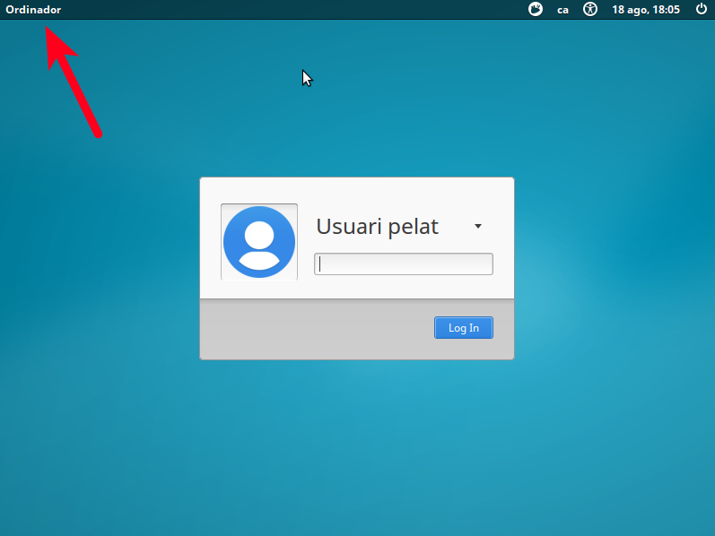

Crear un CD d'Ubuntu autoinstal·lable
================================
La idea és generar un CD que no faci cap pregunta i que permeti fer la instal·lació automàtica d'un sistema amb Xubuntu, servidor SSH i l'usuari 'usuari'.

Després amb Ansible li aplicaré la configuració per defecte de les màquines i tindrem una màquina totalment instal·lada i adaptada al lloc en que s'ha instal·lat.

**Perquè ho faig?**

Els administradors de xarxes d'Ensenyament tenen una mena de passió per clonar màquines que no acabo d'endendre i vull evitar-ho tant com sigui possible.

Clonar màquines no optimitza el sistema, deixa basura en les màquines, tenen problemes si els sistemes no són idèntics, duplica les claus SSH, ... Però el més important és que:

> **odio clonar** 

Per trobar un sistema que m'agradi he anat provant els mètodes que he trobat per fer-ho.

Opció 1 : Kickstart
--------------------------
Fer servir kickstart (de Red Hat) sembla que és la forma més senzilla de fer-ho. De totes formes té algun problema: 

- L'instal·lador d'Ubuntu no suporta totes les opcions de Kickstart. Per exemple no funciona la configuració automàtica de LDAP durant la instal·lació (En Fedora si que va), no es pot configurar el tallafocs, etc.. 
- No té totes les opcions que té el Debian Installer i per tant per algunes opcions s'ha de recórrer a respondre algunes de les preguntes amb un fitxer *preseed*. 

L'avantatge d'aquest sistema és que podem respondre les preguntes habituals amb un entorn gràfic i després només s'ha d'editar el fitxer per afegir-hi les respostes especialitzades d'Ubuntu.

En general he vist que tothom parteix d'un CD amb Ubuntu Server perquè sembla que amb els LiveCD hi ha problemes per aconseguir passar dades a l'instal·lador 

### Procediment per crear el CD

#### 1. Posar els fitxers en un directori temporal

Es munta el CD d'Ubuntu Server en una partició (s'ha de fer com usuari administrador):

    # mkdir -p /mnt/iso
    #  mount -o loop ubuntu-16.04.1-server-amd64.iso /mnt/iso

I es copien els arxius del CD en una carpeta temporal:

    # mkdir -p /opt/ubuntuiso 
    # cp -rT /mnt/iso /opt/ubuntuiso

Aquesta còpia es pot fer servir per fer totes les proves

#### 2. Generar les respostes

Es genera el fitxer de respostes Kickstart a partir del programa **system-config-kickstart** que està disponible en la distribució d'Ubuntu: 

    # apt-get install system-config-kickstart
    # system-config-kickstart

Proporcionarà un entorn gràfic per preparar les respostes. Algunes de les respostes es poden ignorar perquè no estan activades en Ubuntu (configurar entorn gràfic, autenticacions no bàsiques, Tallafocs, etc.. ) i en altres hi faltaran possibilitats (particionat automàtic de disc, ...)

I es graven les respostes en un fitxer. Per exemple *ks.cfg*

El que he fet jo té aquesta forma: 

    #Generated by Kickstart Configurator
    #platform=AMD64 or Intel EM64T

    #System language
    lang ca_ES.UTF-8

    #Language modules to install
    langsupport ca_ES.UTF-8

    #System keyboard
    keyboard es_cat

    #System mouse
    mouse

    #System timezone
    timezone Europe/Madrid

    #Root password
    rootpw --disabled

    #Initial user
    user usuari --fullname "Usuari" --iscrypted --password $1$q1377fKR$sgQw7R1KzxC6drQurGVhm1

    #Reboot after installation
    reboot

    #Use text mode install
    text
    
    #Install OS instead of upgrade
    install

    #Use CDROM installation media
    cdrom

    #System bootloader configuration
    bootloader --location=mbr 

    #Clear the Master Boot Record
    zerombr yes

    #Partition clearing information
    clearpart --all --initlabel 

    #System authorization infomation
    auth  --useshadow  --enablemd5 

    #Firewall configuration
    firewall --disabled 

    #Do not configure the X Window System
    skipx

Al final s'hi poden afegir paquets 'extres' a instal·lar durant la instal·lació afegint la opció **%packages%**: 

    # Paquets a instal·lar
    %packages
    @xubuntu-desktop
    openssh-server
    screen

L'instal·lador d'Ubuntu fa unes quantes preguntes que no es poden respondre amb Kickstart. Per tant s'ha de generar un arxiu *pressed* amb les respostes, en aquest exemple serà **ks.preseed** (algunes respostes pot ser que no calguin perquè he estat fent proves...)

    d-i preseed/early_command string umount /media
    d-i partman/unmount_active boolean true
    d-i partman/confirm_write_new_label boolean true
    d-i partman/choose_partition \
    select Finish partitioning and write changes to disk
    d-i partman/confirm boolean true
    # Per algun motiu xubuntu no se m'instal·lava fins que l'he definit aquí...
    d-i pkgsel/include string xubuntu-desktop

També es poden afegir les respostes directament en el fitxer Kickstart començant-les amb pressed 

    preseed partman-lvm/confirm_nooverwrite boolean true
    preseed partman-lvm/device_remove_lvm boolean true
    preseed partman/confirm_write_new_label boolean true
    preseed partman/confirm boolean true
    preseed partman/confirm_nooverwrite boolean true

Aquests arxius s'han de copiar al que serà l'arrel del CD: 

    # cp ks.cfg /opt/ubuntuiso
    # cp ks.preseed /opt/ubuntuiso

#### 3. Modificar la configuració

Per evitar que s'aturi esperant que triem l'idioma d'instal·lació es pot modificar el valor de *timeout* del fitxer isolinux/isolinux.cfg que està a zero per un valor que indicarà el temps d'espera (10 és un segon): 

    # cat /opt/ubuntuiso/isolinux/isolinux.cfg
    path 
    include menu.cfg
    default vesamenu.c32
    prompt 0
    timeout 10
    ui gfxboot bootlogo

I per acabar la configuració s'ha de modificar la opció del menú d'arrancada, isolinux/txt.cfg, perquè agafi els fitxers KickStart (modificant la opció append): 

    label install
      menu label ^Install Ubuntu Server
      kernel /install/vmlinuz
      append file=/cdrom/preseed/ubuntu-server.seed initrd=/install/initrd.gz ks=cdrom:/ks.cfg preseed/file=/cdrom/ks.preseed --

Com que el fitxer està dins del CD hi he posat **ks=cdrom:/ks.cfg**. De fet el fitxer no cal que sigui dins del CD ja que es pot proporcionar el fitxer amb qualsevol dels mètodes habituals http, ftp, o nfs. Per exemple **ks=http://192.168.88.225/ks.cfg**.

#### 4. Generar la ISO 

Només queda generar la ISO: 

    # mkisofs -D -r -V "ATTENDLESS_UBUNTU" -cache-inodes -J -l -b isolinux/isolinux.bin -c isolinux/boot.cat -no-emul-boot -boot-load-size 4 -boot-info-table -o /opt/autoinstall.iso /opt/ubuntuiso

####  Provar

Es posa el CD en una màquina i el procés d'instal·lació es farà sense cap pregunta. 

Les particions de disc les he de millorar :-)

Opció 2 : Fer servir un fitxer 'preseed'
--------------------------------------------

L'instal·lador de Debian es pot personalitzar simplement creant un fitxer *preseed* amb les respostes a les preguntes ([Documentació](https://help.ubuntu.com/16.04/installation-guide/i386/apbs04.html)).

Segurament aquest opció és la més "correcta" ja que fa servir l'instal·lador de Debian que és la base de l'instal·lador de Ubuntu.

### Procediment per crear el CD

#### 1. Posar els fitxers en un directori temporal 

Ès exactament el mateix que en la opció anterior:

    # mkdir -p /mnt/iso
    # mount -o loop ubuntu.iso /mnt/iso
    # mkdir -p /opt/ubuntuiso 
    # cp -rT /mnt/iso /opt/ubuntuiso

#### 2. Generar les respostes

Generem un fitxer amb les respostes seguint el tutorial ([Documentació](https://help.ubuntu.com/16.04/installation-guide/i386/apbs04.html)): 

    d-i debian-installer/locale string ca_ES.UTF8
    d-i localechooser/supported-locales multiselect ca_ES.UTF-8, en_US.UTF-8

    # Teclat
    d-i console-setup/ask _detect boolean false
    d-i console-setup/layoutcode es
    d-i keyboard-configuration/modelcode string pc105
    d-i keyboard-configuration/layoutcode string es
    d-i keyboard-configuration/variantcode string cat

    ### Configuració de la xarxa
    d-i netcfg/choose_interface select auto
    d-i netcfg/wireless_wep string

    ### Mirror (no tinc clar que calgui)
    choose-mirror-bin mirror/http/proxy string

    ### Sincronitza rellotges
    d-i clock-setup/utc boolean true
    d-i time/zone string Europe/Madrid
    d-i clock-setup/ntp boolean true

    ### Partició de disc amb carpeta /home a part.
    d-i partman-auto/method string lvm
    d-i partman-lvm/device_remove_lvm boolean true
    d-i partman-lvm/confirm boolean true
    d-i partman-auto/choose_recipe select home

    d-i partman/confirm_write_new_label boolean true
    d-i partman/confirm_nooverwrite boolean true
    d-i partman/choose_partition select finish
    d-i partman/confirm boolean true

    d-i partman-lvm/confirm boolean true
    d-i partman-lvm/confirm_nooverwrite boolean true
    d-i partman-auto-lvm/guided_size string max

    ### Usuari per defecte (potser hauria de xifrar la contrasenya)
    d-i passwd/user-fullname string Usuari pelat
    d-i passwd/username string usuari
    #d-i passwd/user-password password patata
    #d-i passwd/user-password-again password patata
    d-i passwd/user-password-crypted password $6$Z2WoBEMQnL5cMx$.2C0ttvnfFyS3hiDrUlIuEGE6r35vjAVec7zIS07FM8zcZuzezNfZicEXa3A/NxMm91q1FRrxYQJLCa8hyIVs1
    d-i user-setup/encrypt-home boolean false
    d-i user-setup/allow-password-weak boolean true

    ### Paquets i repositoris
    d-i mirror/country string ES
    d-i mirror/http/proxy string
    d-i apt-setup/restricted boolean true
    d-i apt-setup/universe boolean true
    d-i pkgsel/install-language-support boolean true
    d-i pkgsel/ignore-incomplete-language-support boolean true

    # Xubuntu i servidor SSH
    d-i pkgsel/include string xubuntu-desktop openssh-server
    d-i pkgsel/update-policy select none

    ### Boot loader installation
    d-i grub-installer/only_debian boolean true
    d-i grub-installer/with_other_os boolean false
    d-i grub-installer/password password patata
    d-i grub-installer/password-again password patata

    ### Finishing up the installation
    d-i finish-install/reboot_in_progress note

La contrasenya la he xifrat fent servir *mkpasswd* però també es pot posar en planer

    mkpasswd -m sha-512 contrasenya

Els paquets els afegeixo amb *pkgsel/include*. En aquest cas instal·lo Xubuntu i el servidor OpenSSH:

    d-i pkgsel/include string xubuntu-desktop openssh-server

Mentres feia proves he descobert com es pot fer perquè crei automàticament la partició arrel, swap i home: 

    d-i partman-auto/choose_recipe select home

Aquest sistema permet posar contrasenya a Grub automàticament (en el fitxer hi he posat 'patata' sense xifrar però es pot posar la contrasenya xifrada)

### 3. Modificar el menú d'arrencada

S'ha de modificar la opció del menú d'arrancada, isolinux/txt.cfg, perquè agafi el fitxer amb la resposta (modificant la opció append). 

El fitxer amb les respostes es pot carregar des de http o ftp (preseed/url): 

    default install
    label install
      menu label ^Install Ubuntu Server
      kernel /install/vmlinuz
      append preseed/url=http://192.168.88.225/preseed.cfg debian-installer/locale=ca_ES netcfg/choose_interface=auto initrd=/install/initrd.gz priority=critical --

En aquest cas la configuració es carrega des d'un servidor web. L'instal·lador se la descarregarà quan la necessiti per poder tenir les respostes i no haver-les de demanar.

Ho hauria pogut fer posant el fitxer en el CD i canviar la línia append per (presed/file): 

    append preseed/file=/cdrom/preseed.cfg debian-installer/locale=ca_ES netcfg/choose_interface=auto initrd=/install/initrd.gz priority=critical --

#### 4. Generar la ISO 

Només queda generar la ISO: 

    # mkisofs -D -r -V "ATTENDLESS_UBUNTU" -cache-inodes -J -l -b isolinux/isolinux.bin -c isolinux/boot.cat -no-emul-boot -boot-load-size 4 -boot-info-table -o /opt/autoinstall.iso /opt/ubuntuiso

####  Provar

Es posa el CD en una màquina i el procés d'instal·lació es farà sense cap pregunta. Tot acabarà amb el sistema instal·lat amb Xubuntu, amb l'usuari 'usuari' i el servidor SSH. 

Opció 3: Que l'instal·lador demani el nom del host
----------------------------------------------------

Un dels problemes al mantenir una xarxa és que a vegades s'espatlla una màquina concreta i actualment el que fem és clonar-ne una altra i després canviar el hostname.

Com que la instal·lació de paquets ja es pot fer amb Ansible estaria bé que instal·lar la màquina pugui ser simplement posar el CD, definir el nom i esperar...

L'instal·lador de Debian no deixa fer preguntes en la instal·lació si hi ha l'opció d'arrencada **priority=critical** (que fa que hi hagi moltes menys preguntes).

* Com fer que l'instal·lació només demani el nom del host?

#### 1. Posar els fitxers en un directori temporal 

Ès exactament el mateix que en la opció anterior:

    # mkdir -p /mnt/iso
    #  mount -o loop ubuntu.iso /mnt/iso
    # mkdir -p /opt/ubuntuiso 
    # cp -rT /mnt/iso /opt/ubuntuiso

### 2. Modificar l'arrencada

Com que demanarà dades l'instal·lador necessita saber quin idioma i quin teclat tenim instal·lat. Per això modifiquem l'entrada del menú, isolinux/text.cfg, perquè arrenqui amb més opcions que en els anteriors casos: 

    default install
    label install
       menu label ^Install Ubuntu Automatic
       kernel /install/vmlinuz
       append preseed/url=http://192.168.88.225/preseed.cfg debian-installer/locale=ca_ES localechooser/translation/warn-severe=true localechooser/translation/warn-light=true keyboard-configuration/modelcode=pc105 keyboard-configuration/layoutcode=es keyboard-configuration/variantcode=cat console-setup/ask_detect=false netcfg/choose_interface=auto initrd=/install/initrd.gz --

D'aquesta forma no es queixarà abans de carregar el fitxer de preseed. 

### 3. Afegir opcions al fitxer pressed

Com que ara demanarà més coses el fitxer pressed s'ha de modificar per respondre-hi: 

    d-i debian-installer/locale string ca_ES.UTF8
    d-i localechooser/supported-locales multiselect ca_ES.UTF-8, en_US.UTF-8

    # Teclat
    d-i console-setup/ask _detect boolean false
    d-i console-setup/layoutcode es
    d-i keyboard-configuration/modelcode string pc105
    d-i keyboard-configuration/layoutcode string es
    d-i keyboard-configuration/variantcode string cat

    ### Configuració de la xarxa
    d-i netcfg/choose_interface select auto
    d-i netcfg/wireless_wep string

    ### Mirror (no tinc clar que calgui)
    choose-mirror-bin mirror/http/proxy string

    ### Sincronitza rellotges
    d-i clock-setup/utc boolean true
    d-i time/zone string Europe/Madrid
    d-i clock-setup/ntp boolean true

    ### Partició de disc amb carpeta /home a part.
    d-i partman-auto/method string lvm
    d-i partman-lvm/device_remove_lvm boolean true
    d-i partman-lvm/confirm boolean true
    d-i partman-auto/choose_recipe select home

    d-i partman/confirm_write_new_label boolean true
    d-i partman/confirm_nooverwrite boolean true
    d-i partman/choose_partition select finish
    d-i partman/confirm boolean true

    d-i partman-lvm/confirm boolean true
    d-i partman-lvm/confirm_nooverwrite boolean true
    d-i partman-auto-lvm/guided_size string max

    ### Usuari per defecte (potser hauria de xifrar la contrasenya)
    d-i passwd/user-fullname string Usuari pelat
    d-i passwd/username string usuari
    #d-i passwd/user-password password patata
    #d-i passwd/user-password-again password patata
    d-i passwd/user-password-crypted password $6$Z2WoBEMQnL5cMx$.2C0ttvnfFyS3hiDrUlIuEGE6r35vjAVec7zIS07FM8zcZuzezNfZicEXa3A/NxMm91q1FRrxYQJLCa8hyIVs1
    d-i user-setup/encrypt-home boolean false
    d-i user-setup/allow-password-weak boolean true

    ### Paquets i repositoris
    d-i mirror/country string ES
    d-i mirror/http/proxy string
    d-i apt-setup/restricted boolean true
    d-i apt-setup/universe boolean true
    d-i pkgsel/install-language-support boolean true
    d-i pkgsel/ignore-incomplete-language-support boolean true

    # Xubuntu i servidor SSH
    tasksel tasksel/first multiselect xubuntu-desktop
    d-i pkgsel/include string openssh-server
    # d-i pkgsel/include string xubuntu-desktop openssh-server
    d-i pkgsel/update-policy select none

    ### Boot loader installation

    d-i grub-installer/only_debian boolean true
    d-i grub-installer/with_other_os boolean false
    d-i grub-installer/password password patata
    d-i grub-installer/password-again password patata

    ### Finishing up the installation
    d-i finish-install/reboot_in_progress note

He hagut de canviar la forma d'instal·lar els paquets perquè sinó em demanava que vull instal·lar.

####  4. Generar el CD i provar

Per generar el CD es fa el mateix que en els altres casos.

Es posa el CD en una màquina, es veurà el procés d'instal·lació i només responent el nom del host tindrem el sistema instal·lat amb l'usuari que volem, el servidor SSH, etc...: 

Com que s'ha d'esperar bastant a que toqui demanar pel nom de la màquina, el sistema no em sembla gaire interessant. 

Segurament el millor és que rebin el nom directament del DHCP

Modificar CD de Xubuntu Live CD
===============================
Un problema que he trobat en la forma d'instal·lar és que al no estar basat en el CD de Xubuntu s'ha de descarregar els paquets durant la instal·lació i per tant tarda una estona ...

El que seria interessant seria poder modificar directament el CD d'instal·lació de Xubuntu (que és un Live CD ... )

El problema està en que fan servir un instal·lador anomenat Ubiquity i tots els intents per automatizar la instal·lació, per ara, han acabat com el rosari de l'Aurora:

* No s'automatitza la instal·lació (no es pot escapar de la pantalla inicial)
* Quan he aconseguit que s'instal·li sense demanar res, no arranca el sistema...

Després de moltes proves he trobat que el problema està en fer les particions amb LVM. Sembla que Ubuntu Server no hi té cap problema però les versions Desktop NO.

Canviant el pressed per: 

    d-i partman-auto/method string regular

Ha solucionat el problema immediatament.

Creació del CD
---------------------

### 1. Fer una còpia temporal del CD
Com sempre es copien els arxius en local per poder modificar-los: 

    # mkdir /mnt/cdrom
    # sudo mount -o loop xubuntu-16.04.1-desktop-amd64.iso /mnt/iso
    # mkdir /opt/iso
    # cp -rT /mnt/iso /opt/iso 

### 2. Modificar els fitxers d'arrencada
Són els mateixos de les opcions anteriors. Per exemple es canvia el timeout a perquè no calgui iniciar el CD manualment '/opt/iso/isolinux/isolinux.cfg'

    path 
    include menu.cfg
    default vesamenu.c32
    prompt 0
    timeout 10
    ui gfxboot bootlogo

Es modifica el fitxer *txt.cfg* del mateix directori per fer que la instal·lació sigui la opció per defecte *default* per *live-install* i es canvien els paràmetres d'arrencada de *live-install* (deixo el teclat americà perquè com que no respondré cap pregunta ... )

    default live-install
    label live-install
      menu label ^Install Xubuntu
      kernel /casper/vmlinuz.efi
      append auto file=/cdrom/xubuntu.cfg keyboard-configuration/layoutcode=us and console-setup/ask_detect=false boot=casper automatic-ubiquity noprompt initrd=/casper/initrd.lz ---

### 3. Crear les respostes
En aquesta opció el fitxer de respostes tindrà unes opcions especials *ubiquity* que són per les opcions que no estan en el Debian Installer.

Per algun motiu la instal·lació extra de paquets amb el sistema de Debian no funciona. Aquesta línia ha estat totalment ignorada:

    d-i pkgsel/include string openssh-server

I l'he hagut de canviar per un script de post instal·lació d'Ubiquity:

    ubiquity ubiquity/success_command string \
    in-target apt-get -y install openssh-server;

El fitxer de respostes xubuntu.cfg tindrà una forma semblant a aquesta: 

    # Respostes de Ubiquity (Ubuntu installer)
    ubiquity languagechooser/language-name select Català
    ubiquity countrychooser/shortlist select ES
    ubiquity time/zone   select  Europe/Madrid
    ubiquity debian-installer/locale select  ca_ES.UTF-8
    ubiquity localechooser/supported-locales multiselect en_US.UTF-8, ca_ES.UTF-8
    ubiquity console-setup/ask_detect    boolean false
    ubiquity keyboard-configuration/layoutcode   select  es
    console-setup   console-setup/layoutcode    string  es

    ubiquity ubiquity/summary note

    ubiquity ubiquity/reboot boolean true

    d-i debian-installer/locale string ca_ES.UTF8
    d-i localechooser/supported-locales multiselect ca_ES.UTF-8, en_US.UTF-8

    # Teclat
    d-i console-setup/ask _detect boolean false
    d-i console-setup/layoutcode es
    d-i keyboard-configuration/modelcode string pc105
    d-i keyboard-configuration/layoutcode string es
    d-i keyboard-configuration/variantcode string cat

    ### Configuració de la xarxa
    d-i netcfg/choose_interface select auto
    d-i netcfg/wireless_wep string

    ### Mirror (no tinc clar que calgui)
    choose-mirror-bin mirror/http/proxy string

    ### Sincronitza rellotges
    d-i clock-setup/utc boolean true
    d-i time/zone string Europe/Madrid
    d-i clock-setup/ntp boolean true

    ### Partitioning
    d-i preseed/early_command string umount /media

    ### Partició de disc amb carpeta /home a part.
    d-i partman-auto/method string regular
    d-i partman-lvm/device_remove_lvm boolean true
    d-i partman-lvm/confirm boolean true
    d-i partman-auto/choose_recipe select home
    d-i partman/default_filesystem string ext4

    d-i partman/confirm_write_new_label boolean true
    d-i partman/confirm_nooverwrite boolean true
    d-i partman/choose_partition select finish
    d-i partman/confirm boolean true

    d-i partman-lvm/confirm boolean true
    d-i partman-lvm/confirm_nooverwrite boolean true
    d-i partman-auto-lvm/guided_size string max

    ### Base system installation

    ### Account setup

    # To create a normal user account.
    d-i passwd/user-fullname string Usuari pelat
    d-i passwd/username string usuari
    #d-i passwd/user-password password patata
    #d-i passwd/user-password-again password patata
    d-i passwd/user-password-crypted password $6$Z2WoBEMQnL5cMx$.2C0ttvnfFyS3hiDrUlIuEGE6r35vjAVec7zIS07FM8zcZuzezNfZicEXa3A/NxMm91q1FRrxYQJLCa8hyIVs1
    d-i user-setup/encrypt-home boolean false
    d-i user-setup/allow-password-weak boolean true

    ### Apt setup
    d-i mirror/country string ES
    d-i mirror/http/proxy string
    d-i apt-setup/restricted boolean true
    d-i apt-setup/universe boolean true
    d-i pkgsel/install-language-support boolean true
    d-i pkgsel/ignore-incomplete-language-support boolean true

    ### Package selection
    # Install the Xubuntu desktop.
    tasksel	tasksel/first	multiselect xubuntu-desktop
    d-i	pkgsel/language-pack-patterns	string
    d-i pkgsel/include string openssh-server
    
    d-i pkgsel/upgrade select none
    d-i pkgsel/update-policy select none

    ### Boot loader installation

    d-i grub-installer/only_debian boolean true
    d-i grub-installer/with_other_os boolean false
    d-i grub-installer/password password patata
    d-i grub-installer/password-again password patata
    # or encrypted using an MD5 hash, see grub-md5-crypt(8).
    #d-i grub-installer/password-crypted password [MD5 hash]
    d-i grub-installer/bootdev  string default

    ### Finishing up the installation
    d-i finish-install/reboot_in_progress note
    ubiquity ubiquity/reboot boolean true
    ubiquity ubiquity/poweroff boolean true

I com que en la configuració he posat que les respostes estaran en el CD hi copio el fitxer xubuntu.cfg a l'arrel 

    # cp xubuntu.cfg /opt/iso