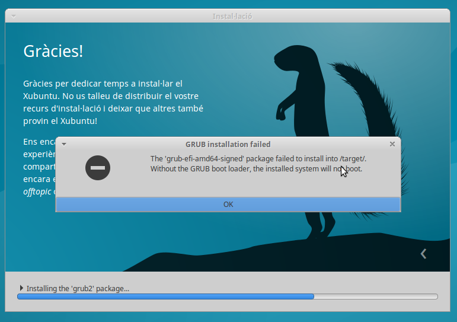

Crear un CD d'Ubuntu autoinstal·lable
================================
La idea és generar un CD que no faci cap pregunta i que permeti fer la instal·lació automàtica d'un sistema amb Xubuntu, servidor SSH i l'usuari 'usuari'.

Després amb Ansible li aplicaré la configuració per defecte de les màquines i tindrem una màquina totalment instal·lada i adaptada al lloc en que s'ha instal·lat.

**Perquè ho faig?**

Els administradors de xarxes d'Ensenyament tenen una mena de passió per clonar màquines que no acabo d'endendre i vull evitar-ho tant com sigui possible.

Clonar màquines no optimitza el sistema, deixa basura en les màquines, tenen problemes si els sistemes no són idèntics, duplica les claus SSH, ... Però el més important és que:

> **odio clonar** 

Per trobar un sistema que m'agradi he anat provant els mètodes que he trobat per fer-ho. 

Primer amb el sistema més senzill: Partir de Ubuntu Server:

* [Opció 1: Fent servir Kickstart](kickstart/README.md)
* [Opció 2: Només fer servir preseed](preseed/README.md)
* [Opció 3: Que demani el hostname](hostdemand/README.md)

Un problema que he trobat en la forma d'instal·lar és que al no estar basat en el CD de Xubuntu s'ha de descarregar els paquets durant la instal·lació i per tant tarda una estona ...

El que seria interessant seria poder modificar directament el CD d'instal·lació de Xubuntu (que és un Live CD ... )

* [Opció 4: Modificar el LiveCD](xubuntu/README.md)

Per mi el millor procediment és generar el fitxer de respostes però no posar-lo en el CD sinó tenir-lo en un servidor HTTP de manera que amb el mateix CD es podran aplicar diferents configuracions simplement modificant el fitxer.

Problemes
-----------------------

### Problemes amb UEFI
Sembla que durant la instal·lació si es fa servir UEFI amb SecureBoot i **NO hi ha connexió a Internet** la instal·lació falla al instal·lar el gestor d'arrencada:

Solucions (pels que no volen saber res del procés)
========================================================

Després de totes les proves al final m'he quedat amb aquestes solucions que estan en la opció 4:

* [BIOS Sense EFI](https://github.com/utrescu/ubuntu-sense-mans/blob/master/xubuntu/NoEFI.md)
* [BIOS i EFI](https://github.com/utrescu/ubuntu-sense-mans/blob/master/xubuntu/EFI.md)

Un cop generada la imatge ISO, es posa el CD en una màquina i el procés d'instal·lació es farà sense cap pregunta:

- Sistema instal·lat amb Xubuntu
- usuari 'usuari'
- servidor SSH.
- Grub protegit amb contrasenya
- Sense cap mena de dubte és el millor sistema.

Més informació a: [blog.utrescu.cat](https://blog.utrescu.cat/blog/2016-08-22-xubuntu_unattended/)
