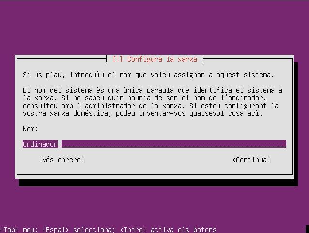

Opció 3: Que l'instal·lador demani el nom del host
----------------------------------------------------

Un dels problemes al mantenir una xarxa és que a vegades s'espatlla una màquina concreta i actualment el que fem és clonar-ne una altra i després canviar el hostname.

Com que la instal·lació de paquets ja es pot fer amb Ansible estaria bé que instal·lar la màquina pugui ser simplement posar el CD, definir el nom i esperar...

L'instal·lador de Debian no deixa fer preguntes en la instal·lació si hi ha l'opció d'arrencada **priority=critical** (que fa que hi hagi moltes menys preguntes).

* Com fer que l'instal·lació només demani el nom del host?

#### 1. Posar els fitxers en un directori temporal 

Ès exactament el mateix que en la opció anterior:

    # mkdir -p /mnt/iso
    #  mount -o loop ubuntu.iso /mnt/iso
    # mkdir -p /opt/ubuntuiso 
    # cp -rT /mnt/iso /opt/ubuntuiso

### 2. Modificar l'arrencada

Com que demanarà dades l'instal·lador necessita saber quin idioma i quin teclat tenim instal·lat. Per això modifiquem l'entrada del menú, isolinux/text.cfg, perquè arrenqui amb més opcions que en els anteriors casos: 

    default install
    label install
       menu label ^Install Ubuntu Automatic
       kernel /install/vmlinuz
       append preseed/url=http://192.168.88.225/preseed.cfg debian-installer/locale=ca_ES localechooser/translation/warn-severe=true localechooser/translation/warn-light=true keyboard-configuration/modelcode=pc105 keyboard-configuration/layoutcode=es keyboard-configuration/variantcode=cat console-setup/ask_detect=false netcfg/choose_interface=auto initrd=/install/initrd.gz --

D'aquesta forma no es queixarà abans de carregar el fitxer de preseed. 

### 3. Afegir opcions al fitxer pressed

Com que ara demanarà més coses el fitxer pressed s'ha de modificar per respondre-hi: 

    d-i debian-installer/locale string ca_ES.UTF8
    d-i localechooser/supported-locales multiselect ca_ES.UTF-8, en_US.UTF-8

    # Teclat
    d-i console-setup/ask _detect boolean false
    d-i console-setup/layoutcode es
    d-i keyboard-configuration/modelcode string pc105
    d-i keyboard-configuration/layoutcode string es
    d-i keyboard-configuration/variantcode string cat

    ### Configuració de la xarxa
    d-i netcfg/choose_interface select auto
    d-i netcfg/wireless_wep string

    ### Mirror (no tinc clar que calgui)
    choose-mirror-bin mirror/http/proxy string

    ### Sincronitza rellotges
    d-i clock-setup/utc boolean true
    d-i time/zone string Europe/Madrid
    d-i clock-setup/ntp boolean true

    ### Partició de disc amb carpeta /home a part.
    d-i partman-auto/method string lvm
    d-i partman-lvm/device_remove_lvm boolean true
    d-i partman-lvm/confirm boolean true
    d-i partman-auto/choose_recipe select home

    d-i partman/confirm_write_new_label boolean true
    d-i partman/confirm_nooverwrite boolean true
    d-i partman/choose_partition select finish
    d-i partman/confirm boolean true

    d-i partman-lvm/confirm boolean true
    d-i partman-lvm/confirm_nooverwrite boolean true
    d-i partman-auto-lvm/guided_size string max

    ### Usuari per defecte (potser hauria de xifrar la contrasenya)
    d-i passwd/user-fullname string Usuari pelat
    d-i passwd/username string usuari
    #d-i passwd/user-password password patata
    #d-i passwd/user-password-again password patata
    d-i passwd/user-password-crypted password $6$Z2WoBEMQnL5cMx$.2C0ttvnfFyS3hiDrUlIuEGE6r35vjAVec7zIS07FM8zcZuzezNfZicEXa3A/NxMm91q1FRrxYQJLCa8hyIVs1
    d-i user-setup/encrypt-home boolean false
    d-i user-setup/allow-password-weak boolean true

    ### Paquets i repositoris
    d-i mirror/country string ES
    d-i mirror/http/proxy string
    d-i apt-setup/restricted boolean true
    d-i apt-setup/universe boolean true
    d-i pkgsel/install-language-support boolean true
    d-i pkgsel/ignore-incomplete-language-support boolean true

    # Xubuntu i servidor SSH
    tasksel tasksel/first multiselect xubuntu-desktop
    d-i pkgsel/include string openssh-server
    # d-i pkgsel/include string xubuntu-desktop openssh-server
    d-i pkgsel/update-policy select none

    ### Boot loader installation

    d-i grub-installer/only_debian boolean true
    d-i grub-installer/with_other_os boolean false
    d-i grub-installer/password password patata
    d-i grub-installer/password-again password patata

    ### Finishing up the installation
    d-i finish-install/reboot_in_progress note

He hagut de canviar la forma d'instal·lar els paquets perquè sinó em demanava que vull instal·lar.

####  4. Generar el CD i provar

Per generar el CD es fa el mateix que en els altres casos.

Es posa el CD en una màquina, es veurà el procés d'instal·lació i només responent el nom del host tindrem el sistema instal·lat amb l'usuari que volem, el servidor SSH, etc...: 

Com que s'ha d'esperar bastant a que toqui demanar pel nom de la màquina, el sistema no em sembla gaire interessant. 

Segurament el millor és que rebin el nom directament del DHCP
