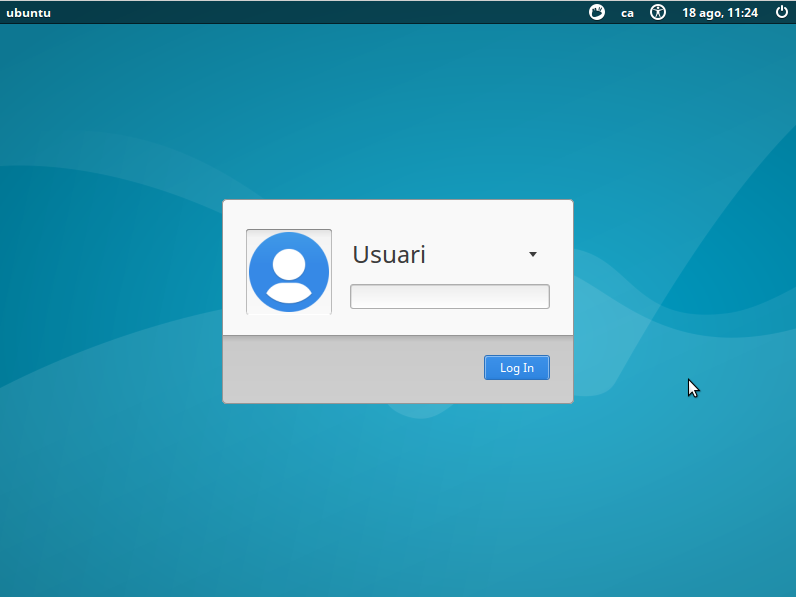

Opció 1 : Kickstart
--------------------------
Fer servir kickstart (de Red Hat) sembla que és la forma més senzilla de fer-ho. De totes formes té algun problema: 

- L'instal·lador d'Ubuntu no suporta totes les opcions de Kickstart. Per exemple no funciona la configuració automàtica de LDAP durant la instal·lació (En Fedora si que va), no es pot configurar el tallafocs, etc.. 
- No té totes les opcions que té el Debian Installer i per tant per algunes opcions s'ha de recórrer a respondre algunes de les preguntes amb un fitxer *preseed*. 

L'avantatge d'aquest sistema és que podem respondre les preguntes habituals amb un entorn gràfic i després només s'ha d'editar el fitxer per afegir-hi les respostes especialitzades d'Ubuntu.

En general he vist que tothom parteix d'un CD amb Ubuntu Server perquè sembla que amb els LiveCD hi ha problemes per aconseguir passar dades a l'instal·lador 

### Procediment per crear el CD

#### 1. Posar els fitxers en un directori temporal

Es munta el CD d'Ubuntu Server en una partició (s'ha de fer com usuari administrador):

    # mkdir -p /mnt/iso
    #  mount -o loop ubuntu-16.04.1-server-amd64.iso /mnt/iso

I es copien els arxius del CD en una carpeta temporal:

    # mkdir -p /opt/ubuntuiso 
    # cp -rT /mnt/iso /opt/ubuntuiso

Aquesta còpia es pot fer servir per fer totes les proves

#### 2. Generar les respostes

Es genera el fitxer de respostes Kickstart a partir del programa **system-config-kickstart** que està disponible en la distribució d'Ubuntu: 

    # apt-get install system-config-kickstart
    # system-config-kickstart

Proporcionarà un entorn gràfic per preparar les respostes. Algunes de les respostes es poden ignorar perquè no estan activades en Ubuntu (configurar entorn gràfic, autenticacions no bàsiques, Tallafocs, etc.. ) i en altres hi faltaran possibilitats (particionat automàtic de disc, ...)

I es graven les respostes en un fitxer. Per exemple *ks.cfg*

El que he fet jo té aquesta forma: 

    #Generated by Kickstart Configurator
    #platform=AMD64 or Intel EM64T

    #System language
    lang ca_ES.UTF-8

    #Language modules to install
    langsupport ca_ES.UTF-8

    #System keyboard
    keyboard es_cat

    #System mouse
    mouse

    #System timezone
    timezone Europe/Madrid

    #Root password
    rootpw --disabled

    #Initial user
    user usuari --fullname "Usuari" --iscrypted --password $1$q1377fKR$sgQw7R1KzxC6drQurGVhm1

    #Reboot after installation
    reboot

    #Use text mode install
    text
    
    #Install OS instead of upgrade
    install

    #Use CDROM installation media
    cdrom

    #System bootloader configuration
    bootloader --location=mbr 

    #Clear the Master Boot Record
    zerombr yes

    #Partition clearing information
    clearpart --all --initlabel 

    #System authorization infomation
    auth  --useshadow  --enablemd5 

    #Firewall configuration
    firewall --disabled 

    #Do not configure the X Window System
    skipx

Al final s'hi poden afegir paquets 'extres' a instal·lar durant la instal·lació afegint la opció **%packages%**: 

    # Paquets a instal·lar
    %packages
    @xubuntu-desktop
    openssh-server
    screen

L'instal·lador d'Ubuntu fa unes quantes preguntes que no es poden respondre amb Kickstart. Per tant s'ha de generar un arxiu *pressed* amb les respostes, en aquest exemple serà **ks.preseed** (algunes respostes pot ser que no calguin perquè he estat fent proves...)

    d-i preseed/early_command string umount /media
    d-i partman/unmount_active boolean true
    d-i partman/confirm_write_new_label boolean true
    d-i partman/choose_partition \
    select Finish partitioning and write changes to disk
    d-i partman/confirm boolean true
    # Per algun motiu xubuntu no se m'instal·lava fins que l'he definit aquí...
    d-i pkgsel/include string xubuntu-desktop

També es poden afegir les respostes directament en el fitxer Kickstart començant-les amb pressed 

    preseed partman-lvm/confirm_nooverwrite boolean true
    preseed partman-lvm/device_remove_lvm boolean true
    preseed partman/confirm_write_new_label boolean true
    preseed partman/confirm boolean true
    preseed partman/confirm_nooverwrite boolean true

Aquests arxius s'han de copiar al que serà l'arrel del CD: 

    # cp ks.cfg /opt/ubuntuiso
    # cp ks.preseed /opt/ubuntuiso

#### 3. Modificar la configuració

Per evitar que s'aturi esperant que triem l'idioma d'instal·lació es pot modificar el valor de *timeout* del fitxer isolinux/isolinux.cfg que està a zero per un valor que indicarà el temps d'espera (10 és un segon): 

    # cat /opt/ubuntuiso/isolinux/isolinux.cfg
    path 
    include menu.cfg
    default vesamenu.c32
    prompt 0
    timeout 10
    ui gfxboot bootlogo

I per acabar la configuració s'ha de modificar la opció del menú d'arrancada, isolinux/txt.cfg, perquè agafi els fitxers KickStart (modificant la opció append): 

    label install
      menu label ^Install Ubuntu Server
      kernel /install/vmlinuz
      append file=/cdrom/preseed/ubuntu-server.seed initrd=/install/initrd.gz ks=cdrom:/ks.cfg preseed/file=/cdrom/ks.preseed --

Com que el fitxer està dins del CD hi he posat **ks=cdrom:/ks.cfg**. De fet el fitxer no cal que sigui dins del CD ja que es pot proporcionar el fitxer amb qualsevol dels mètodes habituals http, ftp, o nfs. Per exemple **ks=http://192.168.88.225/ks.cfg**.

#### 4. Generar la ISO 

Només queda generar la ISO (Per sistemes sense EFI): 

    # mkisofs -D -r -V "ATTENDLESS_UBUNTU" -cache-inodes -J -l \
       -b isolinux/isolinux.bin -c isolinux/boot.cat -no-emul-boot \ 
       -boot-load-size 4 -boot-info-table -o /opt/autoinstall.iso /opt/ubuntuiso

####  Provar

Es posa el CD en una màquina i el procés d'instal·lació es farà sense cap pregunta. 

Les particions de disc les he de millorar :-)
